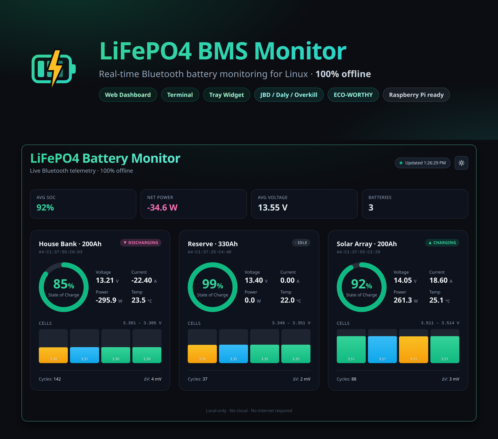
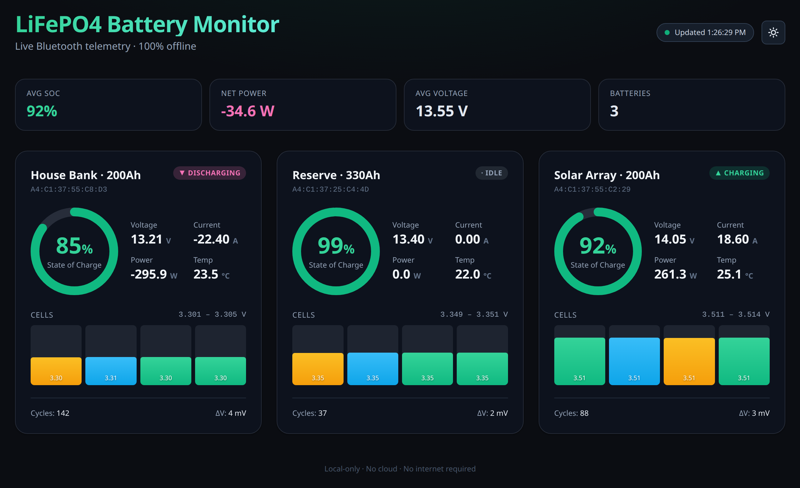
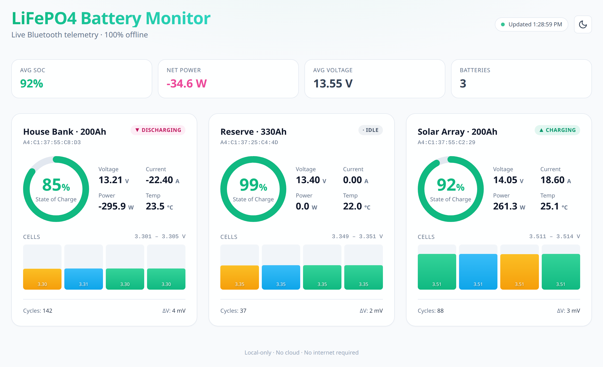
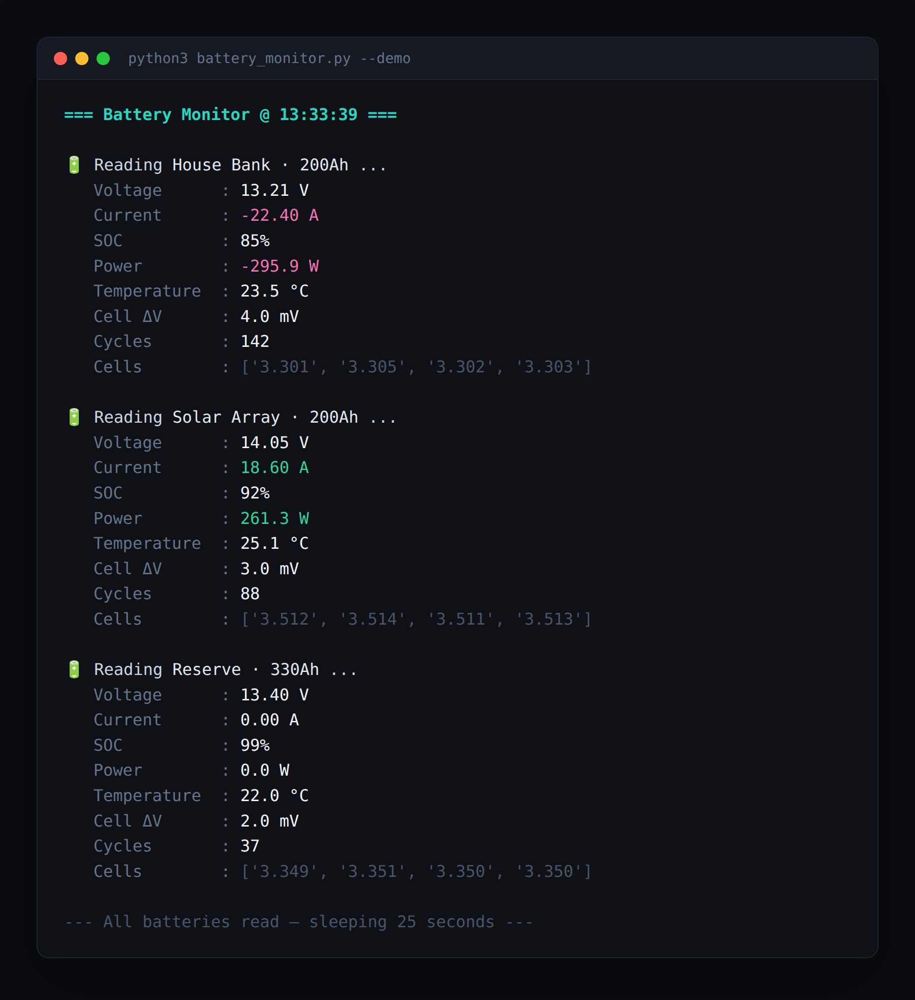

<p align="center">
  
</p>

# LiFePO4 Battery Monitor for Ubuntu / Linux

[](https://github.com/kbennett2000/linux-lifepo4-bms-monitor/releases)
[](LICENSE)
[](https://www.python.org/)
[](#what-you-need-before-you-start)
[](CONTRIBUTING.md)

**Real-time Bluetooth monitoring for JBD-style and ECO-WORTHY LiFePO4 BMS batteries.**

A lightweight, **100% offline** way to keep an eye on the lithium battery banks in your
**off-grid**, **RV / camper / van**, or **solar** setup — straight from your Ubuntu/Linux
laptop, desktop, or a headless **Raspberry Pi** server. No app, no cloud, no account.

Three ways to view your battery data:

| Interface | Script | Best for |
|---|---|---|
| Terminal monitor | `battery_monitor.py` | Quick checks, testing, debugging |
| Web dashboard | `dashboard.py` | Daily use — view from any phone/laptop on your LAN |
| System tray widget | `battery_widget.py` | Always-visible icon on an Ubuntu desktop |

Highlights:
- Supports **multiple batteries** at the same time
- Light/dark theme, mobile-friendly
- **Runs 100% offline** — no cloud, no CDN, no telemetry
- One `config.json` controls everything

Tested on **Ubuntu 24.04** and **22.04** (server and desktop).

> **No battery handy?** Run `python3 dashboard.py --demo` to explore the full UI with
> realistic sample data — no Bluetooth or hardware required.

---

## Screenshots

The web dashboard — one card per battery, with state-of-charge ring, live voltage /
current / power / temperature, per-cell voltages, and a roll-up summary across the bank.
Ships with a built-in light **and** dark theme.

| Dark | Light |
|:---:|:---:|
| [](assets/dashboard-dark.png) | [](assets/dashboard-light.png) |

Prefer the terminal? `battery_monitor.py` prints the same data as a clean text feed —
ideal for quick checks and `ssh`:

<p align="center">
  
</p>

> All screenshots above are real output from `--demo` mode.

---

## Supported BMS

| Brand / Model | Protocol | Notes |
|---|---|---|
| JBD / Jiabaida | Standard JBD | Most common |
| Daly, Overkill, etc. | JBD compatible | Same protocol |
| **ECO-WORTHY** | ECO-WORTHY (MODBUS) | Handled by `aiobmsble`'s ECO-WORTHY driver |
| Others | Any `aiobmsble` driver | Set `protocol` to the driver name, e.g. `"daly"`, `"jikong"` |

---

# Quick Start (TL;DR)

If you already know what you're doing:

```bash
sudo apt update && sudo apt install -y python3-venv bluez git
git clone https://github.com/kbennett2000/linux-lifepo4-bms-monitor.git
cd linux-lifepo4-bms-monitor
python3 -m venv venv && source venv/bin/activate
pip install -r requirements.txt
cp config.example.json config.json
# edit config.json with your batteries' MAC addresses
python3 dashboard.py
```

Open http://127.0.0.1:8040 in a browser. Done.

> Just want to see what it looks like first? Skip the config and run
> `python3 dashboard.py --demo` for a full dashboard backed by sample data.

If you're new to this, follow the step-by-step guide below.

---

# Full Step-by-Step Guide

## What you need before you start

1. A computer running **Ubuntu 22.04 or 24.04** (desktop or server edition, both work), with **Python 3.10 or newer**.
   - **Raspberry Pi users:** use **Raspberry Pi OS Bookworm** (ships Python 3.11). The older Bullseye release ships Python 3.9, which is too old — `pip install` or the dashboard will fail.
2. **A working Bluetooth adapter.** Most laptops have one built in. For a desktop or headless server you may need a USB Bluetooth dongle (any cheap BLE 4.0+ dongle from Amazon works).
3. **Your battery's Bluetooth MAC address.** We'll find this in Step 4.
4. About 5 minutes.

> **Tip:** If you've used your battery's phone app before, close it completely before running these scripts. Most BMS chips can only handle one Bluetooth client at a time.

---

## Step 1 — Install system packages

Open a terminal and paste:

```bash
sudo apt update
sudo apt install -y python3-venv python3-pip bluez git
```

If you **also** want the desktop system-tray widget, add these (skip on a headless server):

```bash
sudo apt install -y python3-gi python3-gi-cairo gir1.2-gtk-3.0 gir1.2-appindicator3-0.1
```

Check that Bluetooth is running:

```bash
systemctl status bluetooth
```

You should see `active (running)` in green. If not:

```bash
sudo systemctl enable --now bluetooth
```

---

## Step 2 — Download the project

```bash
cd ~
git clone https://github.com/kbennett2000/linux-lifepo4-bms-monitor.git
cd linux-lifepo4-bms-monitor
```

You should now be inside the project folder. Confirm with `ls` — you should see `dashboard.py`, `config.example.json`, etc.

---

## Step 3 — Install the Python dependencies

We install everything inside a **virtual environment** (a sandbox folder called `venv`) so it doesn't touch the system Python.

```bash
python3 -m venv venv
source venv/bin/activate
pip install -r requirements.txt
```

After this, your shell prompt will start with `(venv)`. That means the sandbox is active.

> **To re-activate it later** (after closing the terminal): `cd ~/linux-lifepo4-bms-monitor && source venv/bin/activate`

---

## Step 4 — Find your batteries' MAC addresses

Power on your batteries and make sure the BMS phone app is **closed** on all phones in range. Then run:

```bash
python3 tools/clean_scan.py
```

> **Make sure the venv is active first** — your prompt should start with `(venv)`. If it doesn't (e.g. you opened a new terminal), run `cd ~/linux-lifepo4-bms-monitor && source venv/bin/activate` first, or you'll get `ModuleNotFoundError: No module named 'bleak'`.

This will list every nearby Bluetooth device. Look for ones whose name matches your battery (often `JBD`, `xiaoxiang`, `BP00`, `BT-TH-...`, or similar) and **copy the MAC address** (the `XX:XX:XX:XX:XX:XX` part after the `|`).

Example output:

```
📡 xiaoxiang BMS          | A4:C1:37:55:C8:D3
📡 xiaoxiang BMS          | A4:C1:37:55:C2:29
📡 BT-TH-EC9C             | E2:E7:79:8A:56:A3
```

Write down the MAC for each of your batteries — you'll need them in the next step.

---

## Step 5 — Create your config file

Copy the example config and edit it:

```bash
cp config.example.json config.json
nano config.json
```

You'll see this:

```json
{
  "server": { "host": "0.0.0.0", "port": 8040 },
  "ui": {
    "page_title": "LiFePO4 Battery Dashboard",
    "header_title": "Jones Big Ass LiFePO4 Monitor",
    "header_subtitle": "Collectin' Some Good Ass Battery Data!",
    "footer_text": "Local-only · No cloud · No internet required",
    "refresh_seconds": 8,
    "default_theme": "system"
  },
  "batteries": {
    "200ah_01":  { "address": "A4:C1:37:55:C8:D3", "protocol": "jbd",       "label": "200Ah #1",   "rated_capacity_ah": 200 },
    "200ah_02":  { "address": "A4:C1:37:55:C2:29", "protocol": "jbd",       "label": "200Ah #2",   "rated_capacity_ah": 200 },
    "330ah":     { "address": "A4:C1:37:25:C4:4D", "protocol": "jbd",       "label": "330Ah",      "rated_capacity_ah": 330 },
    "ecoworthy": { "address": "E2:E7:79:8A:56:A3", "protocol": "ecoworthy", "label": "ECO-WORTHY", "rated_capacity_ah": 50, "persistent": true }
  }
}
```

**Replace the example batteries with your own.** For each battery, set:

- `address` — the MAC address from Step 4
- `protocol` — `"jbd"` for almost everything, or `"ecoworthy"` for ECO-WORTHY brand. Any other [`aiobmsble` driver](https://pypi.org/p/aiobmsble/) name also works (`"daly"`, `"jikong"`, …); an unrecognised value now stops the dashboard at startup instead of silently never reporting.
- `label` — whatever name you want shown on the dashboard
- `persistent` — optional, default `false`. Hold one BLE connection open for this battery instead of reconnecting every poll. **Recommended for ECO-WORTHY** (see the note below).
- `rated_capacity_ah` — optional. The capacity the battery is sold as, e.g. `200`. It is what the dashboard's capacity readouts are measured against. Leave it out and the battery's own reported full capacity is used instead, which works but hides the difference between rated and actual.

> **ECO-WORTHY note:** these modules accept a single BLE client at a time and some
> firmware revisions stop advertising for good if a connection is torn down without
> being closed properly — recoverable only by discharging the pack to cutoff and
> recharging it. Setting `"persistent": true` makes the dashboard hold one link (the
> way the phone app does) instead of reconnecting a thousand-plus times a day, and
> every disconnect unsubscribes first. Use the **Release for phone app** button on the
> card when you want to use the official app.

To check that a battery is understood before wiring it in, probe it directly:

```bash
python3 tools/test_ecoworthy.py -v            # first ecoworthy battery in config.json
python3 tools/test_ecoworthy.py AA:BB:CC:DD:EE:FF --protocol jbd
```

If `-v` prints `invalid checksum` lines, the driver is reaching your battery but
rejecting its frames — that is a hardware-revision difference worth reporting to
[`aiobmsble`](https://github.com/patman15/aiobmsble/issues).

You can also change:

- `server.port` — defaults to **8040**. Pick another if 8040 is in use.
- `ui.*` — the title, subtitle, footer text shown on the dashboard.
- `ui.refresh_seconds` — how often the page refreshes.
- `ui.default_theme` — `"system"`, `"light"`, or `"dark"`. Users can override with the toggle.

Save and exit nano: **Ctrl+O**, **Enter**, **Ctrl+X**.

---

## Step 6 — First run

```bash
python3 dashboard.py
```

You should see:

```
Dashboard running at http://127.0.0.1:8040
Keep this terminal open while using the dashboard.
```

Open **http://127.0.0.1:8040** in a browser on the same machine. Wait 30–60 seconds for the first battery reading to appear (more batteries = longer first poll). You should see cards with SOC, voltage, current, cell bars, etc.

**To stop:** press **Ctrl+C** in the terminal.

If something didn't work, jump to [Troubleshooting](#troubleshooting).

---

# Using the App

### Web dashboard

```bash
python3 dashboard.py
```

Opens on the port from `config.json` (default **8040**). You can override the host and port at runtime:

```bash
python3 dashboard.py --port 9000                        # CLI flag — port only
python3 dashboard.py --host 192.168.1.50 --port 9000    # CLI flags — host and port
BMS_DASHBOARD_PORT=9000 python3 dashboard.py            # env variable (handy for systemd)
BMS_DASHBOARD_HOST=192.168.1.50 python3 dashboard.py    # bind to a specific interface
```

The `--host` / `BMS_DASHBOARD_HOST` override is useful on a multi-homed host (e.g. a Pi with both `eth0` and `wlan0`) when you want the dashboard to listen on one interface only.

Add `--demo` to either tool to render sample batteries with no Bluetooth — handy for trying the UI, taking screenshots, or developing offline:

```bash
python3 dashboard.py --demo
```

#### Reading the summary strip

**Avg SOC** and **Capacity** answer different questions, and on an uneven bank they give
noticeably different answers.

- **Avg SOC** is the plain mean of each battery's percentage. Every pack counts equally,
  so a 50 Ah battery moves it exactly as much as a 330 Ah one.
- **Capacity** is total available amp-hours over total *rated* amp-hours. It is the
  size-weighted version, and it is the one that tells you how much is actually left in
  the bank.

In the `--demo` bank the two read 79% and 69% — the gap is one large pack being drawn
down while the small ones sit full.

Capacity is measured against `rated_capacity_ah` from `config.json`, not against the
capacity the BMS calls full. That is deliberate: a healthy LiFePO4 pack usually holds a
little more than its rating (a 50 Ah ECO-WORTHY reports 52 Ah), so measuring against the
BMS's own number would pin every healthy pack at exactly 100% and hide the headroom.
**A full pack can therefore read slightly over 100%.** That is the battery beating its
label, not a bug. If a pack has no `rated_capacity_ah` set, its own reported capacity is
used instead; if a pack has no capacity data at all, it drops out of the calculation and
the tile says so (`3 of 4 packs`) rather than quietly reweighting.

Two caveats worth knowing:

- **Amp-hours are whole numbers.** The BMS drivers floor-divide the capacity register, so
  a battery your phone app shows as 52.02 Ah appears here as 52 Ah.
- **On ECO-WORTHY, available amp-hours are derived, not measured** — the BMS reports no
  remaining-capacity register, so the figure is just `full capacity × SOC`. It will track
  the SOC ring exactly. The JBD packs report a real coulomb-counted value.

### Terminal monitor

```bash
python3 battery_monitor.py            # live data
python3 battery_monitor.py --demo     # sample data, no hardware needed
```

Prints a fresh reading for each battery every ~25 seconds. Press Ctrl+C to stop.

### System tray widget (Ubuntu desktop only)

```bash
python3 battery_widget.py
```

> Run this **outside** the venv (`deactivate` first) — the GTK packages live on the system Python.

A `🔋 100% • 85% • ...` indicator appears in your top bar. Click it for full details, or the "Open Dashboard" entry to launch the web view.

You can run any combination of these three tools at the same time.

---

# Run It on a Headless Ubuntu Server (LAN Access)

This section sets up the dashboard to run **automatically at boot** on a Ubuntu Server box, so you can view your batteries from your phone, your laptop, or any other device on your home Wi-Fi.

## Step A — Make sure the server has Bluetooth

A Bluetooth dongle plugged into the server, in range of your batteries. Verify:

```bash
hciconfig
# or
bluetoothctl show
```

You should see a `hci0` adapter listed.

## Step B — Find the server's LAN IP address

```bash
hostname -I
```

You'll get something like `192.168.1.50`. Write it down — that's how other devices will reach the dashboard.

> For convenience, consider giving your server a **static IP** in your router's DHCP settings so the address never changes.

## Step C — Open the firewall (if UFW is enabled)

If `sudo ufw status` shows "active":

```bash
sudo ufw allow 8040/tcp
```

(Substitute your port if you changed it.)

## Step D — Install as a systemd service

This makes the dashboard start at boot and auto-restart if it ever crashes.

> **Prerequisite — the venv must exist on _this_ machine.** The service runs `venv/bin/python`, so if you're setting up a fresh server (rather than the machine where you ran the Quick Start) you must first create and populate the venv here, or the service fails to start with `status=203/EXEC`:
> ```bash
> cd ~/linux-lifepo4-bms-monitor
> python3 -m venv venv
> venv/bin/pip install -r requirements.txt
> ```
> This also installs `bluetooth-auto-recovery` (it's already listed in `requirements.txt`) — the dependency that lets the dashboard recover a wedged Bluetooth adapter on its own. No separate install step is needed.

**1. Find your exact paths:**

```bash
whoami                                   # your username, e.g. "ubuntu"
echo $PWD                                # repo path, e.g. /home/ubuntu/linux-lifepo4-bms-monitor
which python3                            # not used; we want the venv python:
readlink -f venv/bin/python              # e.g. /home/ubuntu/linux-lifepo4-bms-monitor/venv/bin/python
```

**2. Create the service file:**

```bash
sudo nano /etc/systemd/system/bms-dashboard.service
```

Paste the following, replacing `YOUR_USERNAME` and the two paths with the values from step 1:

```ini
[Unit]
Description=LiFePO4 BMS Web Dashboard
After=network-online.target bluetooth.service
Wants=network-online.target bluetooth.service

[Service]
Type=simple
User=YOUR_USERNAME
WorkingDirectory=/home/YOUR_USERNAME/linux-lifepo4-bms-monitor
ExecStart=/home/YOUR_USERNAME/linux-lifepo4-bms-monitor/venv/bin/python dashboard.py
Restart=on-failure
RestartSec=10
# Give the dashboard time to close its BLE connections on stop/restart. Killing it
# outright leaves the battery believing the link is still open, which is what makes
# some BMS modules stop advertising until they are power-cycled.
TimeoutStopSec=30
KillMode=mixed
# Allow the dashboard to recover a wedged BLE adapter on its own (see below).
AmbientCapabilities=CAP_NET_ADMIN CAP_NET_RAW
CapabilityBoundingSet=CAP_NET_ADMIN CAP_NET_RAW

[Install]
WantedBy=multi-user.target
```

Save (**Ctrl+O**, **Enter**, **Ctrl+X**).

> **Why the `CAP_NET_ADMIN` lines?** After hours of scanning, some BLE adapters wedge
> and stop returning devices — historically this needed a manual
> `sudo systemctl restart bluetooth` or a reboot. The dashboard now detects this and
> power-cycles the adapter itself, but that requires `CAP_NET_ADMIN` (to talk to the
> kernel Bluetooth management socket). Without these lines the dashboard still runs and
> still recovers via a `systemctl restart bluetooth` fallback — but that fallback needs
> the service to run as **root**, or a passwordless sudoers rule for that one command.
> Granting the capability to a normal-user service is the cleaner option.

**3. Enable and start it:**

```bash
sudo systemctl daemon-reload
sudo systemctl enable --now bms-dashboard
```

**4. Confirm it's running:**

```bash
systemctl status bms-dashboard
```

You should see `active (running)` in green.

**Useful commands:**

```bash
sudo systemctl restart bms-dashboard      # restart after editing config.json
sudo systemctl stop bms-dashboard         # stop it
sudo systemctl disable bms-dashboard      # don't start at boot anymore
journalctl -u bms-dashboard -f            # live logs (Ctrl+C to exit)
```

## Step E — Access from your phone / other devices

On any device connected to the same Wi-Fi:

> **http://YOUR_SERVER_IP:8040**

e.g. `http://192.168.1.50:8040`

That's it — bookmark it on your phone's home screen for one-tap access.

> **Pro tip:** Most home routers let you assign a hostname like `bms.local` or set a custom DNS entry, so you can use `http://bms.local:8040` instead of remembering an IP.

---

# Configuration Reference

All settings live in `config.json` at the project root.

| Field | What it does |
|---|---|
| `server.host` | Network interface to bind. `0.0.0.0` = all interfaces (needed for LAN access). `127.0.0.1` = local only. |
| `server.port` | Port to listen on. Default `8040`. |
| `ui.page_title` | Browser tab title. |
| `ui.header_title` | Big title shown at the top of the dashboard. |
| `ui.header_subtitle` | Small text under the title. |
| `ui.footer_text` | Text shown at the bottom of the page. |
| `ui.refresh_seconds` | How often the browser polls for new data. Default `8`. |
| `ui.default_theme` | `"system"`, `"light"`, or `"dark"`. Per-user toggle still wins. |
| `batteries.<name>.address` | Bluetooth MAC address (`XX:XX:XX:XX:XX:XX`). |
| `batteries.<name>.protocol` | `"jbd"`, `"ecoworthy"`, or any other `aiobmsble` driver name. |
| `batteries.<name>.label` | Display name on the dashboard. |
| `batteries.<name>.persistent` | Hold one BLE link open instead of reconnecting each poll. Default `false`. |
| `batteries.<name>.rated_capacity_ah` | The capacity the battery is *sold* as, e.g. `50`. Used as the denominator of the capacity readouts. Optional — falls back to the capacity the BMS itself reports as full. |
| `polling.interval_seconds` | Pause between poll cycles. Default `10`. |
| `polling.attempts` | Tries per battery per cycle before counting a miss. Default `2`. |
| `polling.scan_timeout` | Seconds to look for a battery's advertisement. Default `8`. |
| `polling.release_minutes` | Default duration of a "release for phone app". Default `5`. |
| `polling.release_max_minutes` | Upper clamp on a release request. Default `30`. |

Two ways to override the port or host without editing `config.json`:

```bash
python3 dashboard.py --port 9000
BMS_DASHBOARD_PORT=9000 python3 dashboard.py

python3 dashboard.py --host 192.168.1.50
BMS_DASHBOARD_HOST=192.168.1.50 python3 dashboard.py
```

`--host` / `BMS_DASHBOARD_HOST` is useful on a multi-homed host (e.g. a Pi with both `eth0` and `wlan0`) to bind the dashboard to one interface only.

After editing `config.json`, restart the dashboard (or `sudo systemctl restart bms-dashboard` if you set up the service).

---

## Advanced tuning

These four constants are defined at the top of `dashboard.py`. They are **not** in `config.json` — edit `dashboard.py` directly to change them.

| Constant | Default | What it controls |
|---|---|---|
| `STALE_AFTER_MISSES` | `1` | Consecutive missed polls before a battery's card is shown as stale/dimmed. |
| `FETCH_ATTEMPTS` | `2` | Read attempts per battery per cycle before it counts as a miss. |
| `RECOVER_AFTER_MISSES` | `3` | Consecutive misses before the BLE adapter is power-cycled. |
| `RECOVER_COOLDOWN_SECONDS` | `300` | Minimum seconds between adapter-recovery attempts. |

> **Common tweak:** bump `STALE_AFTER_MISSES` to `2` to reduce single-miss flicker on a marginal signal — the card won't dim until two polls in a row fail.

---

# How It Works

- Uses **Bluetooth Low Energy (BLE)** via the `bleak` Python library.
- Every battery is read through `bms_driver.read_battery()`, which picks the matching **`aiobmsble`** driver from the battery's `protocol`. Adding a supported BMS model is a config change, not a code change.
- Batteries marked `"persistent": true` keep **one BLE connection open** across polls; the rest connect and disconnect per poll. Every disconnect unsubscribes from notifications first, runs from a `finally`, and is logged if it fails — BlueZ does not close connections when a process dies, and a peripheral that is never told the link ended can keep believing it is still connected (and a connected peripheral stops advertising).
- On startup, and before any adapter power-cycle, the dashboard sweeps away links BlueZ is still holding from a previous run.
- A background thread polls each battery sequentially (BLE only allows one connection at a time per adapter). Each battery is retried up to `polling.attempts` (2) times per cycle before counting as a miss. On a miss the last-known-good values are **retained** — the card stays visible but is dimmed/marked stale rather than disappearing.
- A background watchdog tracks consecutive misses per battery. A wedged adapter loses *every* battery at once, so recovery only fires when a **quorum** of batteries has missed `RECOVER_AFTER_MISSES` (3) consecutive cycles — one flaky pack can no longer power-cycle the adapter for the whole bank. It graduates from a gentle power-cycle to a USB reset, is rate-limited by `RECOVER_COOLDOWN_SECONDS` (300 s), and falls back to `systemctl restart bluetooth`. See the Troubleshooting section for reading the recovery logs.
- A tiny Flask server serves that data as JSON to the browser at `/api/data`.
- The browser uses vanilla JavaScript + a vendored Tailwind runtime — everything is served locally. **No internet connection is required at any point after install.**

> **Design notes:** two ADRs cover this area — the in-process BLE-adapter recovery
> ([0001](docs/adr/0001-ble-battery-disappearance-recovery.md)) and the persistent
> ECO-WORTHY connection, release switch, and quorum-gated recovery that supersede parts
> of it ([0002](docs/adr/0002-ecoworthy-persistent-connection.md)).

---

# API

The dashboard exposes two read-only JSON endpoints, useful for integrations (e.g. Home Assistant, scripts, or custom UIs), plus two POST endpoints that control the BLE link.

## `GET /api/data`

Returns a JSON object keyed by battery id (the key names from `config.json`'s `batteries` block). Each value contains:

**Measurement fields.** Not every protocol reports every field; anything a protocol
does not provide is `null` and renders as `—`. The **Reports** column below says which
of the two protocols in this project supply each field:

| Field | Type | Reports | Description |
|---|---|---|---|
| `voltage` | float | both | Pack voltage (V) |
| `current` | float | both | Charge/discharge current (A) |
| `power` | float | both | Instantaneous power (W) |
| `soc` | int | both | State of charge (%) |
| `temperature` | float\|null | both | Mean BMS temperature (°C) |
| `temps` | list[float] | both | Each temperature sensor individually; `temperature` is their mean |
| `cells` | list[float] | both | Per-cell voltages (V) |
| `delta_mv` | float\|null | both | Max cell spread (mV) |
| `capacity_ah` | float\|null | both | Amp-hours still available. A real coulomb-counted register on JBD; on ECO-WORTHY it is derived as `capacity_full_ah × soc/100`, so there it tracks SOC exactly and adds nothing SOC doesn't already tell you |
| `capacity_full_ah` | int\|null | both | Amp-hours the BMS considers a full pack. Whole numbers only — the drivers floor-divide the register, so a battery your phone app shows as 52.02 Ah appears here as `52` |
| `rated_ah` | float\|null | config | `rated_capacity_ah` from `config.json`, falling back to `capacity_full_ah` |
| `energy_wh` | int\|null | both | Stored energy (Wh), i.e. `voltage × capacity_ah` |
| `runtime_seconds` | int\|null | both | Estimated seconds to empty. Only derived while discharging; `null` when charging or idle |
| `cycles` | int\|null | JBD | Charge cycle count |
| `chrg_mosfet` | bool\|null | JBD | Charge MOSFET enabled |
| `dischrg_mosfet` | bool\|null | JBD | Discharge MOSFET enabled |
| `balancer` | bool\|int\|null | JBD | Balancer active (reported as a per-cell bit mask) |
| `soh` | float\|null | ECO-WORTHY | State of health (%) |

**Status fields** (always present):

| Field | Type | Description |
|---|---|---|
| `label` | string | Display name from `config.json` |
| `last_seen` | float | Epoch seconds of the last successful read |
| `misses` | int | Consecutive missed polls since the last good reading |
| `stale` | bool | `true` when `misses >= STALE_AFTER_MISSES` |
| `age_seconds` | int | Seconds elapsed since the last successful read |
| `problem` | bool | `true` when the BMS raises a fault, or fails one of the library's sanity checks |
| `problem_code` | int\|null | Raw fault code. Model-specific: this project does not decode it, and neither does `aiobmsble` |

A battery that has never been read yet does not appear in the response at all.

## `GET /api/config`

Returns the `ui` block from `config.json` — useful for reading dashboard titles, refresh interval, etc. without parsing the config file directly.

## `POST /api/ble/release`

Temporarily hands a battery's BLE link back so the official phone app can connect.
These BMS modules accept one client at a time, so a battery held with
`"persistent": true` is otherwise unreachable from the app. The poll loop drops the
link on its next pass and skips the battery until the deadline.

```bash
curl -X POST http://localhost:8040/api/ble/release \
     -H 'Content-Type: application/json' \
     -d '{"battery": "ecoworthy", "minutes": 5}'
```

`minutes` is optional (defaults to `polling.release_minutes`, clamped to
`polling.release_max_minutes`). The battery card's **Release for phone app** button
calls this. Returns `404` for an unknown battery id.

## `POST /api/ble/resume`

Cancels a release early; the dashboard reconnects on the next poll cycle.

```bash
curl -X POST http://localhost:8040/api/ble/resume \
     -H 'Content-Type: application/json' -d '{"battery": "ecoworthy"}'
```

> **Note:** these two are the only endpoints that change anything, and like the rest of
> the API they are unauthenticated. The worst a caller can do is drop a BLE link for a
> few minutes, which is acceptable for a LAN-only tool — but if you expose the
> dashboard beyond your own network, put it behind a reverse proxy with auth.

---

# Troubleshooting

**The dashboard loads but shows "Waiting for first battery reading…" forever**
- Make sure the BMS phone app is fully closed (force-quit on iOS/Android).
- Run `python3 battery_monitor.py` in a separate terminal — it gives more detailed error messages per battery.
- Toggle the system's Bluetooth off and on: `sudo systemctl restart bluetooth`.

**`bleak.exc.BleakError: Bluetooth device is turned off`**
- Run `sudo systemctl enable --now bluetooth`.
- On a server, make sure the USB dongle is plugged in: `lsusb | grep -i blue`.

**Battery doesn't show up in `tools/clean_scan.py`**
- Phone app is open somewhere — close it.
- Battery is out of Bluetooth range (~10m line of sight).
- Battery's BLE module is asleep — touch the battery terminals briefly or wake it via the phone app, then close the app.

**"InProgress" or "Operation already in progress" errors**
- The scripts already serialize batteries to avoid this. If it persists: `sudo systemctl restart bluetooth`.

**Some batteries drop off after the dashboard has been running for hours (and only a reboot or `systemctl restart bluetooth` brings them back)**
- This is a known BLE-on-Linux failure mode: the adapter/BlueZ stack wedges after extended scanning and stops returning some devices.
- The dashboard now handles this automatically — if a battery misses several consecutive polls it power-cycles the adapter in-process (via `bluetooth-auto-recovery`, falling back to `systemctl restart bluetooth`), and the missing batteries return on their own.
- Watch it work: `journalctl -u bms-dashboard -f | grep -E 'recovery|background_updater'`.
- **Reading the `[recovery]` logs:**
  - Success looks like: `[recovery] recover_adapter(hci0, …, gone_silent=False) -> True` (a gentle power-cycle worked; it escalates to `gone_silent=True` only if that fails).
  - A permission failure looks like: `recover_adapter(...) -> False` or a `PermissionError`, usually followed by `[recovery] 'systemctl restart bluetooth' failed: …`. That means the service can't reach the Bluetooth management socket — add the `AmbientCapabilities` lines to the unit file (see *Install as a systemd service*) and `sudo systemctl daemon-reload && sudo systemctl restart bms-dashboard`.
  - If you see **no** `[recovery]` lines at all when batteries drop, recovery isn't being triggered — confirm the dropped battery's MAC is correct (a wrong address looks the same as a wedge).

**A live battery keeps flickering "Stale" and back to normal**
- A card is marked **Stale** after a single missed poll, because one dropped BLE advertisement is common — this is cosmetic and expected on a marginal signal; the card keeps showing its last reading.
- Automatic adapter recovery only kicks in after **3 consecutive** misses, so brief stale flicker does not trigger a power-cycle. If a battery is *constantly* stale, improve the signal (move the dongle closer / add a USB extension) or check for a phone app holding the connection.

**Tray widget icon is invisible / shows nothing**
- Run it **outside** the venv: `deactivate && python3 battery_widget.py`.
- Make sure the AppIndicator system packages from Step 1 are installed.
- On GNOME, install the **AppIndicator** extension.

**ECO-WORTHY values look wrong (huge current, weird SOC)**
- Current off by 10× is the protocol-revision difference between ECO-WORTHY firmware versions; the `aiobmsble` driver detects which one your unit speaks from the frame format. Run `python3 tools/test_ecoworthy.py -v` and check `sum(cells)` against `voltage` — if those agree but current looks wrong, report it upstream.
- If nothing decodes at all, the phone app may be holding the connection — close it, or use the card's **Release for phone app** button so the two never fight over the link.

**The ECO-WORTHY has vanished from Bluetooth entirely and won't come back**
- If it does not appear in `bluetoothctl scan on` at all, its BLE module is wedged: it believes a connection is still open, so it has stopped advertising. Only a power cycle of the BMS clears this — discharge to cutoff and recharge.
- Set `"persistent": true` for that battery (see the config section). Holding one link, the way the phone app does, avoids the repeated teardowns that trigger this.
- Always stop the service with `systemctl stop bms-dashboard` rather than `kill -9`, so the links are closed properly on the way out.

**Dashboard works from the server but not from my phone**
- Check `server.host` is `0.0.0.0` (not `127.0.0.1`).
- Check the firewall: `sudo ufw allow 8040/tcp`.
- Make sure you're on the **same Wi-Fi network** as the server.
- Try `curl http://SERVER_IP:8040/` from another machine on the LAN.

**`Address already in use` when starting the dashboard**
- Something else is using port 8040. Either stop it, or change `server.port` in `config.json`.

**systemd service shows `(code=exited, status=203/EXEC)`**
- The `ExecStart` path is wrong. Re-run `readlink -f venv/bin/python` and update the service file.

---

# Contributing

PRs welcome! Especially:
- Support for additional BMS models
- Support for more BMS models
- Docker / container support
- Home Assistant integration

See **[CONTRIBUTING.md](CONTRIBUTING.md)** for the dev setup, how to run the app in
`--demo` mode without hardware, coding conventions, and how to report a new BMS.
Notable changes are tracked in the **[CHANGELOG](CHANGELOG.md)**.

---

# License

MIT License — feel free to use, modify, and share.

Made with care for the DIY solar / off-grid community.
If this helped you, please star the repo!
